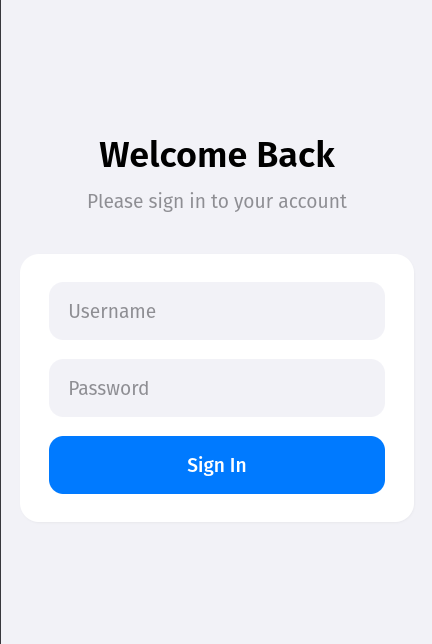
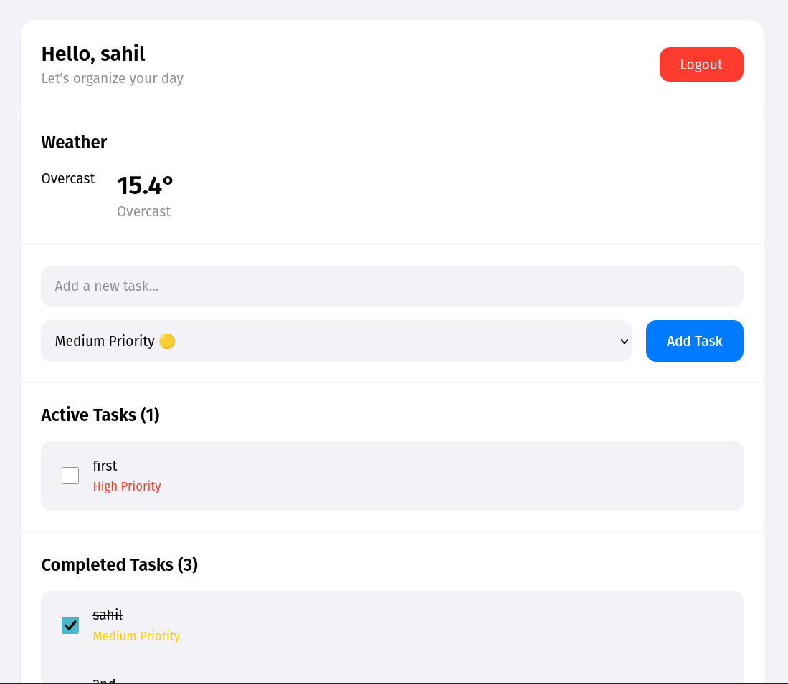

#Task Manager

A modern, responsive task management application built with React, Redux, and Tailwind CSS, featuring an iOS-inspired design system.




## Features

### 🔐 Authentication
- Simple username/password login system
- Demo account available for testing
- Secure session management with Redux

### 📝 Task Management
- Create, complete, and delete tasks
- Priority levels (High 🔴, Medium 🟡, Low 🟢)
- Automatic sorting by priority
- Separate views for active and completed tasks
- Responsive design optimized for all screen sizes

### 🌤️ Weather Integration
- Real-time weather updates
- Automatic refresh every 30 minutes
- Clean, iOS-style weather display

### 🎨 iOS Design System
- Native iOS color palette
- System-consistent typography
- iOS-style inputs and buttons
- Smooth animations and transitions

## Tech Stack

- **Frontend Framework**: React 18
- **State Management**: Redux Toolkit
- **Styling**: Tailwind CSS
- **API Integration**: Axios
- **Build Tool**: Vite
- **Weather API**: Open-Meteo API

## Getting Started

### Prerequisites

- Node.js 16.0 or later
- npm or yarn

### Installation

1. Clone the repository:
```bash
git clone https://github.com/ShoreNexx/TODOlist.git
```

2. Navigate to the project directory:
```bash
cd TODOlist
```

3. Install dependencies:
```bash
npm install
```

4. Start the development server:
```bash
npm run dev
```

5. Open your browser and visit `http://localhost:5173`

### Demo Account

Use these credentials to test the application:
- Username: //anything
- Password: //anything

## Project Structure

```
src/
├── components/          # React components
│   ├── Login.jsx       # Authentication component
│   ├── TaskInput.jsx   # Task creation form
│   ├── TaskList.jsx    # Task display and management
│   └── Weather.jsx     # Weather widget
├── store/              # Redux store configuration
│   ├── authSlice.js    # Authentication state
│   ├── todoSlice.js    # Tasks and weather state
│   └── store.js        # Store configuration
└── App.jsx             # Main application component
```

## Features in Detail

### Task Management

- **Task Creation**: Add new tasks with customizable priority levels
- **Priority System**: Three-tier priority system with visual indicators
- **Task Organization**: Automatic sorting based on priority
- **Task Status**: Toggle between active and completed states
- **Bulk Management**: Separate views for active and completed tasks

### Weather Integration

- **Real-time Updates**: Current temperature and weather conditions
- **Auto-refresh**: Weather data updates every 30 minutes
- **Error Handling**: Graceful error states with retry functionality

### Responsive Design

- **Mobile-First**: Optimized for all screen sizes
- **Adaptive Layout**: Fluid transitions between screen sizes
- **Touch-Friendly**: Large touch targets for mobile users
- **Consistent Experience**: Maintains iOS design language across devices

## Contributing

1. Fork the repository
2. Create your feature branch (`git checkout -b feature/AmazingFeature`)
3. Commit your changes (`git commit -m 'Add some AmazingFeature'`)
4. Push to the branch (`git push origin feature/AmazingFeature`)
5. Open a Pull Request

## License

This project is licensed under the MIT License - see the [LICENSE](LICENSE) file for details.

## Acknowledgments

- Design inspired by iOS Human Interface Guidelines
- Weather data provided by Open-Meteo API
- Icons from various open-source projects